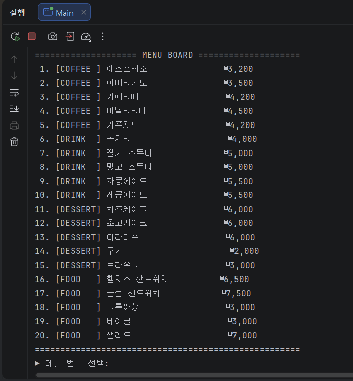
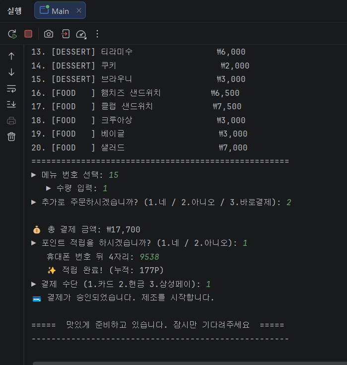
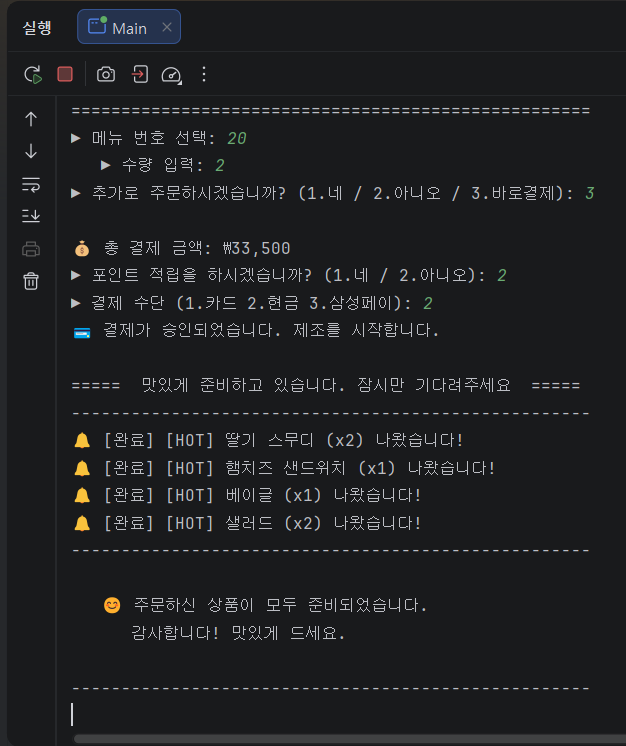
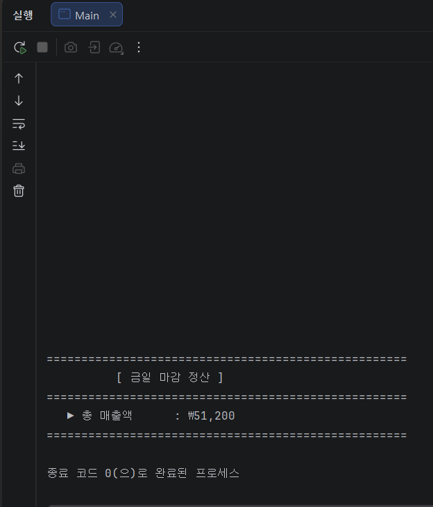

# ☕ Cafe Kiosk System (콘솔 기반 키오스크)

## 📌 프로젝트명

Cafe Kiosk System (자바 콘솔 카페 키오스크)

---

## 📖 프로그램 개요

본 프로그램은 자바 콘솔 환경에서 동작하는 카페 키오스크 시스템으로,

사용자가 메뉴를 선택하고 주문 및 결제를 진행할 수 있도록 구현하였다.

또한 재고 관리, 포인트 적립, 관리자 모드(매출 확인) 기능을 포함하여

실제 키오스크와 유사한 흐름을 경험할 수 있도록 설계하였다.

---

## ⚙️ 사용한 주요 자바 개념

- 객체지향 프로그래밍(OOP)
- 클래스 및 객체 설계
- Enum (메뉴 관리)
- 컬렉션 프레임워크 (Map, List)
- 싱글톤 패턴 (OrderService)
- 예외 처리 (try-catch)
- 문자열 포맷팅 (printf, String.format)
- 스레드 (Thread.sleep → 대기 및 애니메이션 효과)

---

## 🧱 클래스 구성 설명

### 📍 Main

- 프로그램의 전체 실행 흐름 담당
- 메뉴 출력, 주문 처리, 결제 로직 포함

### 📍 Menu (Enum)

- 메뉴 정보 관리 (이름, 가격, 카테고리, 옵션)
- 메뉴 리스트를 효율적으로 관리

### 📍 Order

- 주문 객체 (메뉴명, 가격, 수량 등 저장)

### 📍 InventoryService

- 재고 관리 클래스
- 재고 확인 및 차감 기능 제공

### 📍 OrderService (Singleton)

- 주문 내역 저장
- 총 매출 계산 기능 제공

---

## ▶️ 실행 방법

### 1. 컴파일

javac -d . Main.java

### 2. 실행

java com.cafe.kiosk.Main

※ IntelliJ 사용 시 Run 버튼으로 실행 가능

---

## ✨ 주요 기능 설명

### 🛒 1. 메뉴 선택 및 주문

- 메뉴 번호 입력으로 상품 선택
- HOT / ICE 옵션 선택 가능
- 수량 입력 및 다중 주문 가능

### ❌ 2. 재고 관리

- 재고 부족 시 주문 불가 처리 (각 메뉴 품절 처리되는 개수는 다름)
- 품절 메뉴 표시 기능

### 💰 3. 결제 시스템

- 카드 / 현금 / 삼성페이 선택 가능
- 결제 완료 후 제조 시작

### 🎁 4. 포인트 적립

- 휴대폰 번호 입력 시 1% 적립
- 사용자별 포인트 누적 관리

### 👨‍💼 5. 관리자 모드

- 비밀번호 입력 시 접근 가능
- 총 매출 확인 기능 제공

### 🍳 6. 제조 애니메이션

- 주문 완료 후 시간 지연을 통해 실제 제조 느낌 구현
- 완료 메시지 출력(알림식으로 표시)

---

## 🛠️ 본인이 구현한 부분

- 전체 키오스크 흐름 설계 및 구현
- 메뉴 출력 정렬 (한글 길이 계산 포함)
- 재고 시스템 및 예외 처리 로직
- 포인트 적립 기능
- 관리자 매출 확인 기능
- 사용자 입력 검증 및 UX 개선
- 콘솔 UI 구성 (메뉴판, 안내 메시지)

---

## 🤖 AI 활용 여부 및 활용 범위 (바이브코딩)

- ChatGPT를 활용하여:
    - 코드 구조 설계 보조
    - 예외 처리 및 로직 개선
    - 문자열 정렬 및 UI 개선
    - README 문서 작성
- 전체 코드 구현은 직접 작성 및 수정하였으며 AI는 보조 도구로 활용됨

---

## 📌 기타

- 한글 문자열 길이 계산을 통한 정렬 문제를 완전히 해결 못했다

---

## 📸 실행 화면

실행 화면 이미지는 `images` 폴더에 포함되어 있습니다.

---
